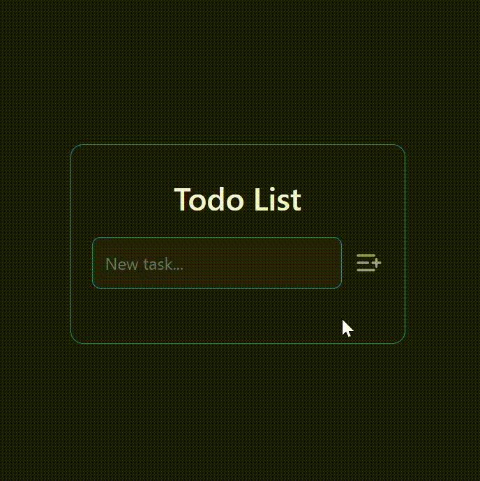

[React Badge]: https://img.shields.io/badge/React-61dafb?style=for-the-badge&logo=react&labelColor=000
[Vite Badge]: https://img.shields.io/badge/Vite-646cff?style=for-the-badge&logo=vite&labelColor=000
[Tailwind Badge]: https://img.shields.io/badge/Tailwindcss-06b6d4?style=for-the-badge&logo=tailwindcss&labelColor=000
[Typescript Badge]: https://img.shields.io/badge/Typescript-3178c6?style=for-the-badge&logo=typescript&labelColor=000

<h1 align="center" style="font-weight: bold;">Todo List</h1>

<div align="center">

![react][React Badge]
![vite][Vite Badge]
![typescript][Typescript Badge]
![tailwind][Tailwind Badge]

</div>

### Conteúdo

- [Projeto](#pushpin-projeto)

- [Funcionalidades](#memo-funcionalidades)

- [Teconologias](#computer-tecnologias)

## :pushpin: Projeto

<br>

Lista de tarefas simples, desenvolvida em React e TypeScript.

<br>

<p align="center">
  
</p>

### :arrow_down: Baixando o Projeto

### Pré-requisitos

- [NodeJs](https://nodejs.org/en/download/current)

- [Git](https://git-scm.com/downloads) (Opcional)

<br>

Caso tenha o Git instalado, você pode clonar o projeto:

```bash
git clone https://github.com/willvgomes/todo-list.git
```

ou [baixar](https://github.com/willvbgomes/todo-list/archive/refs/heads/main.zip) o .ZIP diretamente.

<br>

### :arrow_forward: Rodando o Projeto

Após baixar ou clonar o projeto, instale suas dependências e inicie um servidor local:

```bash
cd todo-list
npm install
npm run dev
```

<br>

## :memo: Funcionalidades

:white_check_mark: Adicionar uma nova tarefa;

:white_check_mark: Marcar uma tarefa como concluída;

:white_check_mark: Desmarcar uma tarefa como concluída;

:white_check_mark: Apagar uma tarefa.

<br>

## :computer: Tecnologias

- React

- Typescript

- TailwindCSS

- Vite
